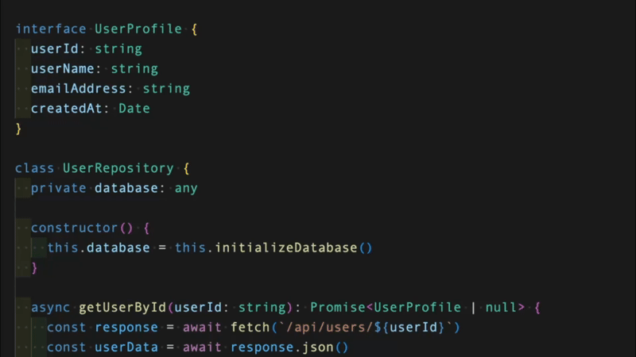

# Codeku（コードク）

> コードを「読む」- Display Japanese readings for code identifiers on hover

[](https://marketplace.visualstudio.com/items?itemName=yoritin.codeku)
[](https://opensource.org/licenses/MIT)

<p align="center">
  
</p>

## ✨ Features

- **ホバーで読みを表示** - 変数名、関数名、クラス名などにホバーすると日本語の読み（カタカナ）を表示
- **識別子の自動分割** - camelCase, PascalCase, snake_case, kebab-case を自動認識
- **プログラミング略語対応** - API, HTTP, URL などの頻出略語にも対応

## 📦 Installation

1. VSCodeを開く
2. Extensions (`Ctrl+Shift+X`) を開く
3. "Codeku" で検索
4. Install をクリック

または、[Visual Studio Marketplace](https://marketplace.visualstudio.com/items?itemName=yoritin.codeku) から直接インストール。

## 🚀 Usage

インストール後、対応言語のファイルを開いて識別子にホバーするだけ！

### 対応言語

- TypeScript / JavaScript
- Python
- Go
- Rust

## ⚙️ Settings

| Setting               | Description                                         | Default                                                |
| --------------------- | --------------------------------------------------- | ------------------------------------------------------ |
| `codoku.enabled`      | 拡張機能の有効/無効                                 | `true`                                                 |
| `codoku.languages`    | 有効にする言語                                      | `["typescript", "javascript", "python", "go", "rust"]` |
| `codoku.showOriginal` | 元の単語も表示                                      | `true`                                                 |
| `codoku.readingStyle` | 読みのスタイル (`katakana` / `hiragana` / `romaji`) | `"katakana"`                                           |

## 🤝 Contributing

貢献を歓迎します！特に辞書データの拡充にご協力ください。

詳細は [CONTRIBUTING.md](./CONTRIBUTING.md) をご覧ください。

### 辞書への単語追加

`packages/extension/src/data/words.json` に単語を追加してPRを送ってください。

```json
{
  "word": "repository",
  "reading": "リポジトリ"
}
```

## 📝 License

MIT License - see [LICENSE](./LICENSE) for details.

## 🔗 Links

- [Landing Page](https://yoritin.github.io/codeku/)
- [GitHub Repository](https://github.com/yoritin/codeku)
- [VS Code Marketplace](https://marketplace.visualstudio.com/items?itemName=yoritin.codeku)
- [Issue Tracker](https://github.com/yoritin/codeku/issues)
